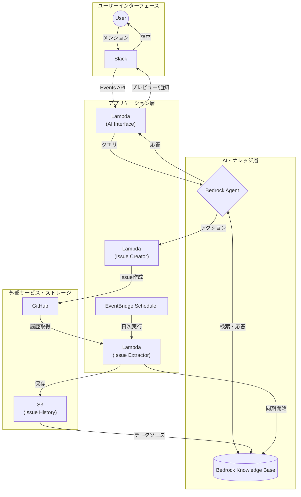
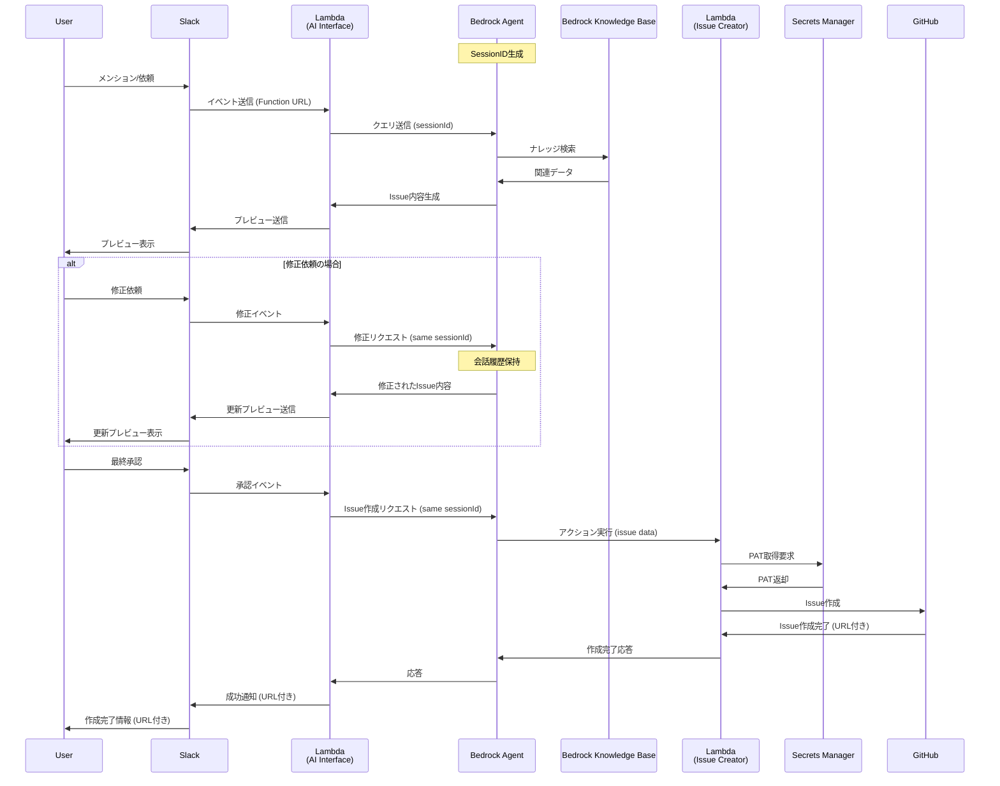
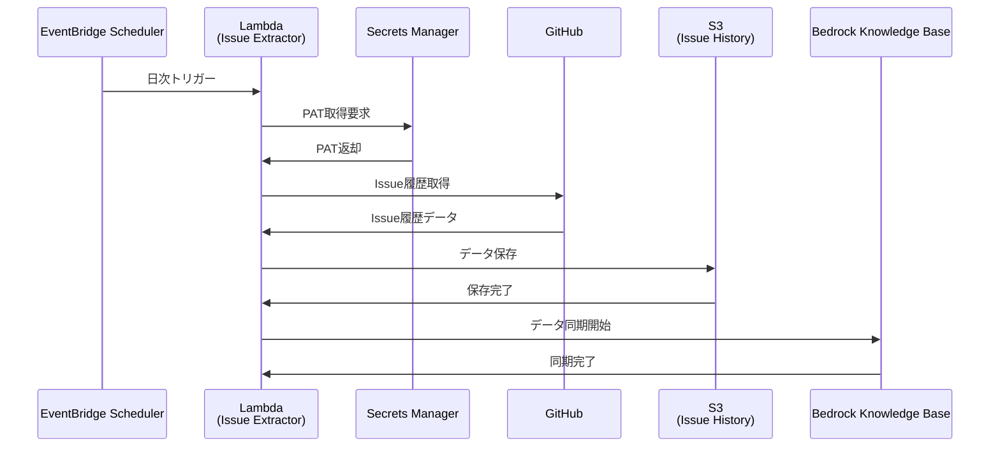

# システム設計

## 概要

AWS Bedrockを活用したSlackベースのIssue起票システム。ユーザーがSlackから依頼することで、過去のIssue履歴を参照しつつAIが適切なIssueを自動生成する。

## 特徴

- AWS上に構築されたシステム
- Slackでメンションして依頼することでGitHub Issueの作成が可能
- 依頼すると文案を提示し、対話により文案の修正が可能
- 作成を指示するとIssueを起票する
- クローズ済みIssueを収集し、Issue作成時の前提知識とする

## システム概要図



## 処理シーケンス

### Issue作成

#### 処理概要

- ユーザーがSlackでBotにメンションしてIssue作成を依頼
- SlackのEvents APIからLambda Function URL経由でLambda（AI Interface）にイベント送信
- LambdaがBedrock Agentにクエリを送信してIssue内容の生成を依頼
- Bedrock AgentがKnowledge Baseから過去のIssue履歴や関連情報を検索
- 検索結果を基にBedrock AgentがIssue作成内容（タイトル、本文、ラベル等）を生成
- 生成されたIssue内容をSlackに返信してユーザーに確認を求める
- ユーザーが修正依頼をした場合、同一SessionIDで対話を継続し内容を修正
- 最終承認後、Bedrock AgentがアクションでLambda（Issue Creator）を呼び出し
- Lambda（Issue Creator）がGitHub APIを使用してIssueを作成
- 作成完了とIssue URLをSlackに通知

#### セッション管理

Bedrock Agentとの対話継続性を確保するため、SlackのスレッドとBedrock AgentのSessionIDを紐付けて管理します。

##### SessionID生成ロジック

```python
def generate_session_id(slack_event):
    user_id = slack_event['user']
    channel_id = slack_event['channel']
    thread_ts = slack_event.get('thread_ts')
    message_ts = slack_event['ts']
    
    if thread_ts:
        # スレッド内での会話 - thread_tsをベースにセッションID作成
        root_ts = thread_ts
    else:
        # チャンネルでの新しい会話開始 - 現在のメッセージがルートになる
        root_ts = message_ts
    
    # セッションIDの形式: user_channel_root-timestamp
    session_id = f"{user_id}_{channel_id}_{root_ts}"
    return session_id
```

##### 管理方式の特徴

- **外部ストレージ不要**: SlackイベントのメタデータからSessionIDを決定論的に生成
- **一意性保証**: ユーザー + チャンネル + ルートタイムスタンプの組み合わせで完全にユニーク
- **スレッド対応**: Slackのスレッド内メッセージは同一SessionIDで継続、新規メンションは新SessionID
- **制限適合**: AWS Bedrock Agent SessionIDの制限（2-100文字、パターン `[0-9a-zA-Z._:-]+`）に適合

#### シーケンス図



### Issue履歴抽出

#### 処理概要

- EventBridge Schedulerが日次でLambda（Issue Extractor）を起動
- LambdaがSecrets ManagerからGitHub Personal Access Token（PAT）を取得
- 取得したPATを使用してGitHub APIから**前日にクローズしたIssue**の履歴データを取得
  - GitHub API: `GET /repos/{owner}/{repo}/issues?state=closed&closed:YYYY-MM-DD..YYYY-MM-DD`
- 取得したIssue履歴をFrontmatter Markdown形式でS3バケットに保存
- Bedrock Knowledge BaseのStartIngestionJob APIを実行してS3データを同期
- Knowledge Baseが新しいIssue履歴データを学習データとして利用可能になる

#### シーケンス図



#### 保存データ形式

##### ファイル名形式

```
{repository}/{issue_number}_{closed_date}.md
```

例: `my-project/123_2024-01-15.md`

##### Frontmatter Markdown形式

```markdown
---
issue_number: 123
title: "バグ修正: ログイン機能のエラーハンドリング"
state: closed
created_at: 2024-01-10T09:00:00Z
closed_at: 2024-01-15T17:30:00Z
assignee: "yamada-taro"
labels: ["bug", "frontend", "high-priority"]
repository: "my-project"
url: "https://github.com/org/my-project/issues/123"
---

# Issue概要

ログイン画面でパスワードを間違えた際のエラーメッセージが表示されない問題を修正しました。

## 問題内容

- パスワード入力エラー時にエラーメッセージが表示されない
- ユーザーがエラーの原因を特定できない

## 解決方法

1. エラーハンドリングロジックの修正
2. UI側でのエラーメッセージ表示機能の実装
3. 適切なエラーメッセージテキストの追加

## 影響範囲

- ログイン機能全般
- エラーハンドリング機能

## テスト内容

- 正常ログインのテスト
- 異常系（パスワード間違い）のテスト
- エラーメッセージ表示のテスト
```

