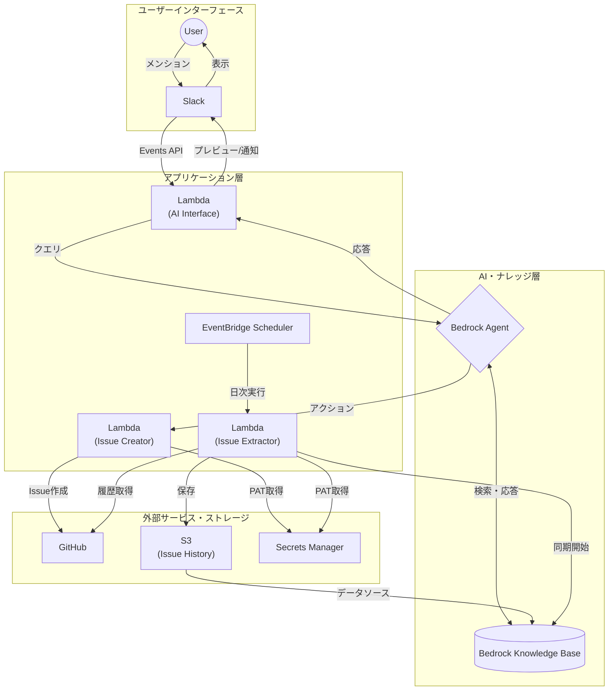
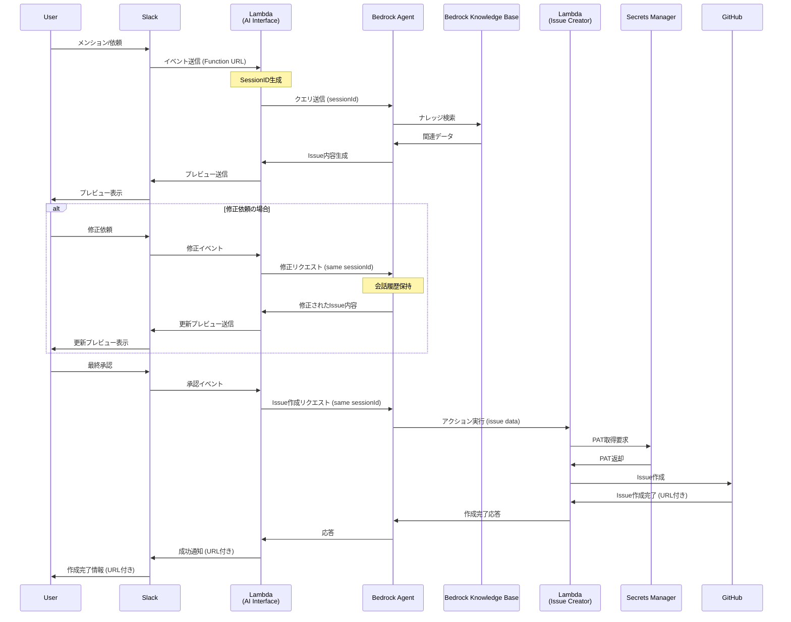
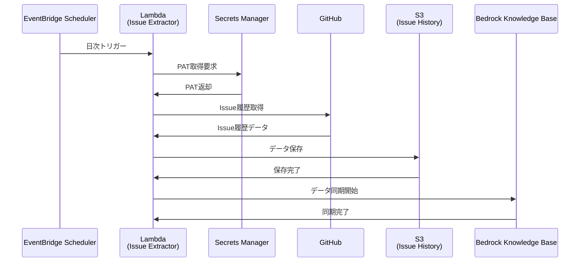

# システム設計

## 概要

AWS Bedrockを活用したSlackベースのIssue起票システム。ユーザーがSlackから依頼することで、過去のIssue履歴を参照しつつAIが適切なIssueを自動生成する。

## 特徴

- **Slack連携**: メンションベースの直感的なIssue作成インターフェース
- **AI支援**: 過去のIssue履歴を参照した適切なIssue内容の自動生成
- **対話式修正**: プレビュー確認と修正依頼による段階的なIssue精度向上
- **自動学習**: クローズ済みIssueの日次収集によるナレッジベース更新

## システム概要図



## アプリケーション一覧

実装するアプリケーションの概要と仕様を定義します。

### Issue発行 (issue_creator)

#### 概要

GitHub Issue作成を実行するLambda関数

#### デプロイ先

AWS Lambda（Bedrock Agentからのアクション呼び出し用）

#### 入力

Bedrock Agentからのアクション呼び出し時のJSONペイロード：

```json
{
  "messageVersion": "1.0",
  "agent": {
    "name": "issue-agent",
    "id": "ABCDEFGHIJ", 
    "alias": "TSTALIASID",
    "version": "DRAFT"
  },
  "inputText": "バグ修正のIssueを作成してください",
  "sessionId": "U123456789_C987654321_1234567890.123456",
  "actionGroup": "issue-creator",
  "apiPath": "/create-issue",
  "httpMethod": "POST",
  "parameters": [
    {
      "name": "repository",
      "type": "string", 
      "value": "my-org/my-repo"
    },
    {
      "name": "title",
      "type": "string",
      "value": "ログイン機能のバグ修正"
    },
    {
      "name": "body",
      "type": "string",
      "value": "## 問題内容\nログイン時にエラーが発生する\n\n## 解決方法\nバリデーション処理の修正が必要"
    },
    {
      "name": "labels",
      "type": "array",
      "value": "[\"bug\", \"priority-high\"]"
    }
  ]
}
```

#### 処理

1. Secrets ManagerからGitHub PATを取得
2. GitHub API経由でIssue作成
3. 作成結果をレスポンス

#### 出力

Bedrock Agentへのレスポンス：

```json
{
  "messageVersion": "1.0",
  "response": {
    "actionGroup": "issue-creator",
    "apiPath": "/create-issue",
    "httpMethod": "POST",
    "httpStatusCode": 200,
    "responseBody": {
      "application/json": {
        "body": "{\"issue_url\":\"https://github.com/my-org/my-repo/issues/123\",\"issue_number\":123,\"status\":\"created\"}"
      }
    }
  }
}

### AI Interface (ai_interface)

#### 概要

Slack Events APIを受信してBedrock Agentとやり取りするLambda関数

#### デプロイ先

AWS Lambda（Function URL有効化でSlack連携）

#### 入力

Slack Events APIからのapp_mentionイベント：

```json
{
  "token": "ZZZZZZWSxiZZZ2yIvs3peJ",
  "team_id": "T123ABC456",
  "api_app_id": "A123ABC456",
  "event": {
    "type": "app_mention",
    "user": "U123ABC456",
    "text": "<@U0LAN0Z89> ログイン機能のバグ修正Issueを作成してください",
    "ts": "1515449522.000016",
    "channel": "C123ABC456",
    "event_ts": "1515449522000016",
    "thread_ts": "1515449522.000015"
  },
  "type": "event_callback",
  "event_id": "Ev123ABC456",
  "event_time": 1515449522000016,
  "authed_users": [
    "U0LAN0Z89"
  ]
}
```

#### 処理

1. SlackイベントからSessionID生成
2. Bedrock Agentにクエリ送信
3. 応答をSlackに転送

#### 出力

Slackへの応答（HTTP 200 OK）：

```json
{
  "statusCode": 200,
  "headers": {
    "Content-Type": "application/json"
  },
  "body": "{\"challenge\":\"3eZbrw1aBm2rZgRNFdxV2595E9CY3gmdALWMmHkvFXO7tYXAYM8P\"}"
}
```

Slack APIへのメッセージ投稿：

```json
{
  "channel": "C123ABC456",
  "text": "Issue内容を確認してください：\n\n**タイトル**: ログイン機能のバグ修正\n**内容**: ログイン時にエラーが発生する問題の修正\n**ラベル**: bug, priority-high\n\n作成してよろしいですか？",
  "thread_ts": "1515449522.000016"
}
```

### Issue履歴抽出 (issue_extractor)

#### 概要

GitHub Issue履歴を定期収集してS3保存・Knowledge Base更新するLambda関数

#### デプロイ先

AWS Lambda（EventBridge Schedulerから日次実行）

#### 入力

EventBridge Schedulerからの定期実行時の入力（空のイベントまたはカスタムペイロード）：

```json
{
  "version": "0",
  "id": "12345678-1234-1234-1234-123456789012",
  "detail-type": "Scheduled Event",
  "source": "aws.scheduler",
  "account": "123456789012",
  "time": "2024-12-15T09:00:00Z",
  "region": "ap-northeast-1",
  "resources": ["arn:aws:scheduler:ap-northeast-1:123456789012:schedule/default/issue-extractor-daily"],
  "detail": {
    "target_date": "2024-12-14"
  }
}
```

#### 処理

1. Secrets ManagerからGitHub PATを取得
2. 前日クローズのIssue履歴をGitHub APIから取得
3. Frontmatter Markdown形式でS3に保存
4. Bedrock Knowledge BaseのStartIngestionJob実行

#### 出力

Lambda実行結果：

```json
{
  "statusCode": 200,
  "body": {
    "processed_issues": 5,
    "s3_files": [
      "my-project/123_2024-12-14.md",
      "my-project/124_2024-12-14.md",
      "my-project/125_2024-12-14.md",
      "my-project/126_2024-12-14.md",
      "my-project/127_2024-12-14.md"
    ],
    "knowledge_base_sync": {
      "ingestion_job_id": "ABCDEFGHIJKLMNOP",
      "status": "STARTING"
    },
    "execution_time": "2024-12-15T09:00:15Z"
  }
}
```

## 処理シーケンス

### Issue作成

#### 処理概要

- ユーザーがSlackでBotにメンションしてIssue作成を依頼
- SlackのEvents APIからLambda Function URL経由でLambda（AI Interface）にイベント送信
- LambdaがBedrock Agentにクエリを送信してIssue内容の生成を依頼
- Bedrock AgentがKnowledge Baseから過去のIssue履歴や関連情報を検索
- 検索結果を基にBedrock AgentがIssue作成内容（タイトル、本文、ラベル等）を生成
- 生成されたIssue内容をSlackに返信してユーザーに確認を求める
- ユーザーが修正依頼をした場合、同一SessionIDで対話を継続し内容を修正
- 最終承認後、Bedrock AgentがアクションでLambda（Issue Creator）を呼び出し
- Lambda（Issue Creator）がGitHub APIを使用してIssueを作成
- 作成完了とIssue URLをSlackに通知

#### セッション管理

Bedrock Agentとの対話継続性を確保するため、SlackのスレッドとBedrock AgentのSessionIDを紐付けて管理します。

##### SessionID生成ロジック

```python
def generate_session_id(slack_event):
    user_id = slack_event['user']
    channel_id = slack_event['channel']
    thread_ts = slack_event.get('thread_ts')
    message_ts = slack_event['ts']

    if thread_ts:
        # スレッド内での会話 - thread_tsをベースにセッションID作成
        root_ts = thread_ts
    else:
        # チャンネルでの新しい会話開始 - 現在のメッセージがルートになる
        root_ts = message_ts

    # セッションIDの形式: user_channel_root-timestamp
    session_id = f"{user_id}_{channel_id}_{root_ts}"
    return session_id
```

##### 管理方式の特徴

- **外部ストレージ不要**: SlackイベントのメタデータからSessionIDを決定論的に生成
- **一意性保証**: ユーザー + チャンネル + ルートタイムスタンプの組み合わせで完全にユニーク
- **スレッド対応**: Slackのスレッド内メッセージは同一SessionIDで継続、新規メンションは新SessionID
- **制限適合**: AWS Bedrock Agent SessionIDの制限（2-100文字、パターン `[0-9a-zA-Z._:-]+`）に適合

#### シーケンス図



### Issue履歴抽出

#### 処理概要

- EventBridge Schedulerが日次でLambda（Issue Extractor）を起動
- LambdaがSecrets ManagerからGitHub Personal Access Token（PAT）を取得
- 取得したPATを使用してGitHub APIから**前日にクローズしたIssue**の履歴データを取得
  - GitHub API: `GET /repos/{owner}/{repo}/issues?state=closed&closed:YYYY-MM-DD..YYYY-MM-DD`
- 取得したIssue履歴をFrontmatter Markdown形式でS3バケットに保存
- Bedrock Knowledge BaseのStartIngestionJob APIを実行してS3データを同期
- Knowledge Baseが新しいIssue履歴データを学習データとして利用可能になる

#### シーケンス図



#### 保存データ形式

##### ファイル名形式

```
{repository}/{issue_number}_{closed_date}.md
```

例: `my-project/123_2024-01-15.md`

##### Frontmatter Markdown形式

```markdown
---
issue_number: 123
title: "バグ修正: ログイン機能のエラーハンドリング"
state: closed
created_at: 2024-01-10T09:00:00Z
closed_at: 2024-01-15T17:30:00Z
assignee: "yamada-taro"
labels: ["bug", "frontend", "high-priority"]
repository: "my-project"
url: "https://github.com/org/my-project/issues/123"
---

# Issue概要

ログイン画面でパスワードを間違えた際のエラーメッセージが表示されない問題を修正しました。

## 問題内容

- パスワード入力エラー時にエラーメッセージが表示されない
- ユーザーがエラーの原因を特定できない

## 解決方法

1. エラーハンドリングロジックの修正
2. UI側でのエラーメッセージ表示機能の実装
3. 適切なエラーメッセージテキストの追加

## 影響範囲

- ログイン機能全般
- エラーハンドリング機能

## テスト内容

- 正常ログインのテスト
- 異常系（パスワード間違い）のテスト
- エラーメッセージ表示のテスト
```
