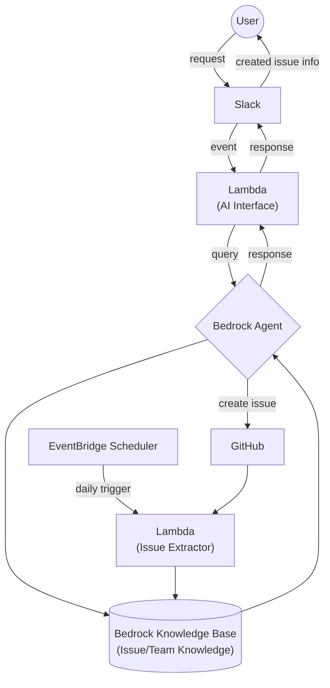
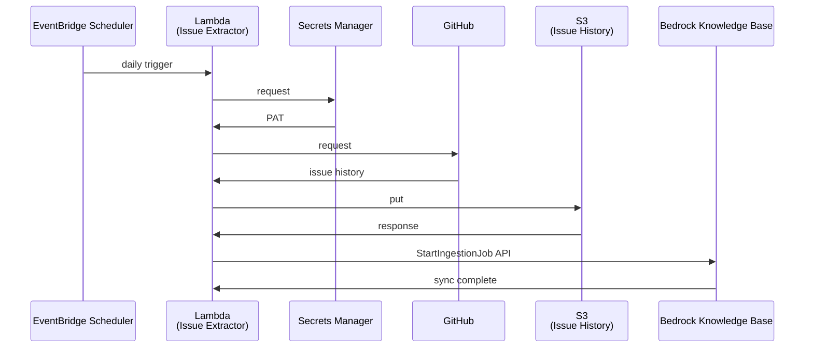

# システム設計

## 概要

AWS Bedrockを活用したSlackベースのIssue起票システムです。ユーザーがSlackでメンションすることで、AIが適切なIssueを自動生成します。

## 特徴

- AWS上に構築されたシステム
- Slackでメンションして依頼することでGitHub Issueの作成が可能
- 依頼すると文案を提示し、指示するとIssueを作成する
- 対話により文案の修正も可能
- クローズ済みIssueを日次で収集し、Issue作成時の参考にする

## 処理フロー



## 処理シーケンス

### Issue履歴抽出

#### 処理概要

- EventBridge Schedulerが日次でLambda（Issue Extractor）を起動
- LambdaがSecrets ManagerからGitHub Personal Access Token（PAT）を取得
- 取得したPATを使用してGitHub APIから**前日にクローズしたIssue**の履歴データを取得
  - GitHub API: `GET /repos/{owner}/{repo}/issues?state=closed&closed={前日日付}`
- 取得したIssue履歴をFrontmatter Markdown形式でS3バケットに保存
- Bedrock Knowledge BaseのStartIngestionJob APIを実行してS3データを同期
- Knowledge Baseが新しいIssue履歴データを学習データとして利用可能になる

#### シーケンス図



#### 保存データ形式

##### ファイル名形式

```
{repository}/{issue_number}_{closed_date}.md
```

例: `my-project/123_2024-01-15.md`

##### Frontmatter Markdown形式

```markdown
---
issue_number: 123
title: "バグ修正: ログイン機能のエラーハンドリング"
state: closed
created_at: 2024-01-10T09:00:00Z
closed_at: 2024-01-15T17:30:00Z
assignee: "yamada-taro"
labels: ["bug", "frontend", "high-priority"]
repository: "my-project"
url: "https://github.com/org/my-project/issues/123"
---

# Issue概要

ログイン画面でパスワードを間違えた際のエラーメッセージが表示されない問題を修正しました。

## 問題内容

- パスワード入力エラー時にエラーメッセージが表示されない
- ユーザーがエラーの原因を特定できない

## 解決方法

1. エラーハンドリングロジックの修正
2. UI側でのエラーメッセージ表示機能の実装
3. 適切なエラーメッセージテキストの追加

## 影響範囲

- ログイン機能全般
- エラーハンドリング機能

## テスト内容

- 正常ログインのテスト
- 異常系（パスワード間違い）のテスト
- エラーメッセージ表示のテスト
```

## コンポーネント詳細

### フロントエンド

- **Slack**: ユーザーインターフェース、メンション受付

### API レイヤー

- **API Gateway**: Slackイベントの受信エンドポイント

### アプリケーションレイヤー

- **Lambda (AI Interface)**: Slackイベント処理、Bedrock連携、レスポンス生成

### AI レイヤー

- **Bedrock Agent**: AIエージェント、自然言語処理
- **Bedrock Knowledge Base**: ナレッジベース、情報検索

## データフロー

1. **ユーザー操作**: SlackでBotにメンション
2. **イベント送信**: SlackからAPI Gatewayにイベント送信
3. **リクエスト処理**: LambdaでSlackイベントを解析
4. **AI処理**: Bedrock AgentでIssue内容を生成
5. **情報検索**: Knowledge Baseから関連情報を取得
6. **レスポンス生成**: 生成されたIssue情報をSlackに返信
